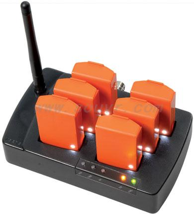

# Xsens MTw Awinda driver for ROS2

This project contains a ROS2 driver for the Xsens MTw Awinda system sensors.




## Hardware

- Xsens MTw Awinda System


## Software

- The driver is developed upon the XDA 2022, with ROS2 on Ubuntu 22.04 LTS
    - XDA 2022 =/= public XDA 2022 (the public XDA 2022 only supports MTi devices)
    - No need to download the Xsens MT Software Suite for Linux separately
    - ISO C++17 Standard corrections have been applied to the XDA 2022 files
- Instead of using the Xsens Quaternion, this driver uses the state-of-the-art quaternion filter [VQF](https://doi.org/10.1016/j.inffus.2022.10.014)


## Prerequisites

- [Ubuntu Linux](https://www.releases.ubuntu.com/)
- [ROS2](https://docs.ros.org/)

Tested with Ubuntu 22.04 and ROS2 Humble.


## Features

- Data recording
- Node control through button presses or ros2 services
- Orientation visualization in RViz for multiple IMUs at the same time
- Custom .yaml config file


## Usage

The driver upsamples the IMU data and publishes all sensor data into the `/xsens_imu_data` topic. \
Custom messages `IMUData.msg`, `IMUDataArray.msg` and `Quaternion.msg` are used. \
The `/config/params.yaml` can be used to easily set the desired parameters.
The `/config/imu_mapping.yaml` is only used for a specific IMU setup. It will just move the orientations in a more "visually correct" position. Using `xsens_mtw_visualization` without any config, will just publish the TFs of all IMUs next to each other for visibility.


#### Commands:

- `ros2 run xsens_mtw_driver_ros2 xsens_mtw_manager`
- `ros2 run xsens_mtw_driver_ros2 xsens_mtw_visualization`
- `ros2 launch xsens_mtw_driver_ros2 xsens_mtw_manager.launch.py` (loads `/config/params.yaml` but [no keyboard inputs](#no-keyboard-inputs-for-launch-files))
- `ros2 launch xsens_mtw_driver_ros2 xsens_mtw_visualization.launch.py` (loads `config/imu_mapping.yaml`) [experimental]


#### Custom Services:

- `/xsens_mtw_manager/status`
- `/xsens_mtw_manager/get_ready`
- `/xsens_mtw_manager/start_recording`
- `/xsens_mtw_manager/stop_recording`

These services are using the `std_srvs/srv/trigger.hpp`.


### Recording

The time in `timestamp` is tracked from the start of the node and will be reset to `0` when starting to record by default. This can be changed in the params.yaml in the future. \
Currently the recording will only save the quaternions. \
Currently the recorded data is saved in the same directy where the node is started.


### Supported sensor update rates for the Xsens MTw Awinda System

|    IMUs  | desiredUpdateRate (max) |
|----------|-------------------------|
|   1 - 5  |           120 Hz        |
|   6 - 9  |           100 Hz        |
|      10  |            80 Hz        |
| 11 - 20  |            60 Hz        |
| 21 - 32  |            40 Hz        |


## Xsens MTw Awinda IMU Orientation


## No keyboard inputs for launch files

Starting the `xsens_mtw_manager` node through launch files will prevent `conio.c` from reading terminal keyboard inputs. Use the [custom node services](#custom-services) instead or manually add the parameters in the command line when running the node. Example:

```
ros2 run xsens_mtw_driver_ros2 xsens_mtw_manager --ros-args -p ros2_rate:=200 -p imu_rate:=100
```


## Troubleshooting

Make sure you are in the correct group:

```
$ ls -l /dev/ttyUSB0

crw-rw---- 1 root dialout 188, 0 May 4 13:37 /dev/ttyUSB0

$ groups

"username" adm cdrom sudo dip plugdev lpadmin sambashare
```

Add yourself to the group:
```
$ sudo usermod -G dialout -a $USER
$ newgrp dialout
```

More troubleshooting on the [xsens_mti_driver page](http://wiki.ros.org/xsens_mti_driver)


### ROS2 Coding in VSCode ROS2:

Make sure to add `/opt/ros/<ros2version>/include/**` to the `includePath` in your `c_cpp_properties.json` from your `.vscode` folder.


## Related links

- [Xsens Software & Documentation](https://www.movella.com/support/software-documentation)
- [VQF - A Versatile Quaternion-based Filter for IMU Orientation Estimation](https://vqf.readthedocs.io/)
- [qleonardolp - xsens_mtw_driver-release](https://github.com/qleonardolp/xsens_mtw_driver-release)
- [ChangcongWang - xsens_mtw_driver-release [fork] (ROS2 Migration with Xsens SDK 4.6)](https://github.com/ChangcongWang/xsens_mtw_driver-release)


## TODO

- Implement more parameters for `/config/params.yaml`
- Remove debugging logs
- Better Code (efficiency, follow coding conventions, etc.)