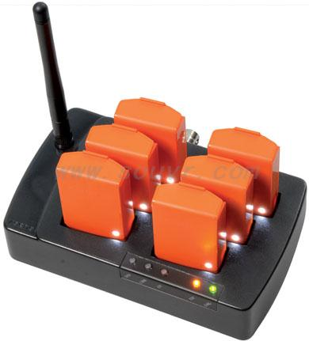
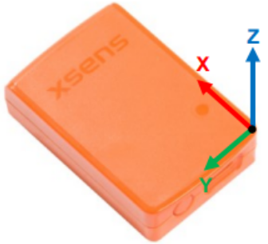

# Xsens MTw Awinda driver for ROS2

## Overview

This project contains a ROS2 driver for the Xsens MTw Awinda system sensors.

### Features

- Data recording
- IMU timeout warning
- Custom .yaml config file
- Node control via terminal key presses or ROS2 services
- Simultaneous orientation visualization in RViz for multiple IMUs

### Hardware

- Xsens MTw Awinda System



#### Supported sensor update rates for the Xsens MTw Awinda System

|    IMUs  | Update Rate (Max)       |
|:--------:|:-----------------------:|
|   1 - 5  |           120 Hz        |
|   6 - 9  |           100 Hz        |
|      10  |            80 Hz        |
| 11 - 20  |            60 Hz        |
| 21 - 32  |            40 Hz        |

#### Xsens MTw Coordinate System



### Software

- The driver is developed upon the XDA 2022, with ROS2 on Ubuntu 22.04 LTS
  - XDA 2022 =/= public XDA 2022 (the public XDA 2022 only supports MTi devices)
  - No need to download the Xsens MT Software Suite for Linux separately
  - ISO C++17 Standard corrections have been applied to the XDA 2022 files
- Instead of using the Xsens Quaternion, this driver uses the state-of-the-art quaternion filter [VQF](https://doi.org/10.1016/j.inffus.2022.10.014)

## Getting Started

### Prerequisites

- [Ubuntu Linux](https://www.releases.ubuntu.com/)
- [ROS2](https://docs.ros.org/)

Tested with Ubuntu 22.04 (ROS2 Humble) and 24.04 (ROS2 Jazzy).

## Usage

Follow the usual ROS2 workspace setup by building and sourcing the package.

```sh
colcon build
source install/setup.bash
```

### Xsens MTw Manager

By default, the Xsens MTw Manager node publishes all sensor data into the `/xsens_imu_data` ROS2 topic. The topic name and other parameters can be adjusted in the `/config/params.yaml` file. See [Custom parameters](#custom-parameters) for more information.

ROS2 timestamps are used to record the time at which data is received. If a data packet is lost, the last available data will be used. The recorded data is saved in a `.csv` file with multi-indexing (header of 3). This file will include the ROS2 timestamps with the received MTw orientation, angular velocity, linear acceleration and the magnetic field. The recorded data is saved in the same directory where the node is started.

---

Commands:

```sh
ros2 run xsens_mtw_driver xsens_mtw_manager
```

or

```sh
ros2 launch xsens_mtw_driver xsens_mtw_manager.launch.py
```

> Loads the `/config/params.yaml` but [no keyboard inputs](#no-keyboard-inputs-for-launch-files)!

---

#### Custom Services

The `xsens_mtw_manager` offers custom services listed below, for which custom message types `IMUData.msg`, `IMUDataArray.msg`, `Quaternion.msg`, `Trigger.srv`, `StartRecording.srv` from the custom `imu_msgs` and `xsens_srvs` packages are used.

- `/xsens_mtw_manager/status`
- `/xsens_mtw_manager/get_ready`
- `/xsens_mtw_manager/start_recording`
- `/xsens_mtw_manager/stop_recording`
- `/xsens_mtw_manager/imu_reset`
- `/xsens_mtw_manager/restart`

The `/get_ready` service is used to accept the currently connected MTw's and start to publish the data.

The `/start_recording` service optionally offers a id (int64) to be set which will be used in the filename for the recorded data. By default the filename will be automatically generated.

The `/imu_reset` service resets the Quaternion filter and thus all quaternions to identity quaternions. By default this will happen at the start of every recording.

The `/restart` service restarts the node and can be used as an alternative way for restarting the ROS2 node.

#### Custom parameters

The `/config/params.yaml` can be used to easily set the desired parameters. Make sure to launch the node with `ros2 launch` so the config is loaded. Alternatively you can use the ROS2 in the terminal to modify them without needing to rebuild the package. See [No keyboard inputs for launch files](#no-keyboard-inputs-for-launch-files) for more information.

If the `ros2_rate` is larger than the `imu_rate`, the node will upsample the IMU data by always using the last available data until the next data is received. The `imu_rate` is the maximum rate the IMUs can send data. Make sure to follow the [supported sensor update rates](#supported-sensor-update-rates-for-the-xsens-mtw-awinda-system).

| Parameter           | Description                                            |
|---------------------|--------------------------------------------------------|
| one_topic_per_imu   | Switch between one-topic-for-all and one-topic-per-imu |
| topic_name          | ROS2 topic name for published data                     |
| ros2_rate           | ROS2 data publish rate                                 |
| imu_rate            | IMU data update rate                                   |
| imu_reset_on_record | Reset IMU orientation on record start                  |
| use_magnetometer    | Use Magnetometer data to update orientations           |

#### No keyboard inputs for launch files

Starting the `xsens_mtw_manager` node through launch files will prevent `conio.c` from reading terminal keyboard inputs. If you still need them, use the [custom node services](#custom-services) instead or manually add the parameters in the command line when running the node to avoid using `ros2 launch`.

---

Example:

```sh
ros2 run xsens_mtw_driver xsens_mtw_manager --ros-args -p ros2_rate:=100.0 -p imu_rate:=100
```

> Make sure to use the correct parameter type!

or

```sh
ros2 run xsens_mtw_driver xsens_mtw_manager --ros-args --params-file </path/to/params.yaml>
```

---

### Xsens MTw Visualization

The `xsens_mtw_visualization` node publishes the IMU orientations in the `/tf` ROS2 topic for visualization purposes in RViz. Make sure to|---------------------|--------------------------------------------------------|
 have the TF display added in RViz. Also see [Xsens MTw Awinda IMU Coordinate System](#xsens-mtw-awinda-imu-coordinate-system) to know which way the IMUs are oriented.

Using `xsens_mtw_visualization` without any config, will publish the TFs of all IMUs next to each other. Using the launch file will load `/config/imu_mapping.yaml`. This is only used for a specific IMU setup. The idea behind it is to move the IMU orientations into a more visually comprehensible position. The amount of IMUs can be adjusted in the `.yaml` file and the positions inside the `xsens_mtw_visualization.cpp` file.

---

Commands:

```sh
ros2 run xsens_mtw_driver xsens_mtw_visualization
```

or

```sh
ros2 launch xsens_mtw_driver xsens_mtw_visualization.launch.py
```

> Loads the `/config/imu_mapping.yaml`. [experimental]

---

## Troubleshooting

- **Problem**: Xsens MTw Manager node cannot find the connected Xsens MTw Docking Station / Dongle.

  **Verify**: Make sure you are in the correct group:

  ```sh
  $ ls -l /dev/ttyUSB0

  crw-rw---- 1 root dialout 188, 0 May 4 13:37 /dev/ttyUSB0

  $ groups

  "username" adm cdrom sudo dip plugdev lpadmin sambashare
  ```

  **Solution**: Add yourself to the group. Be sure to replace `dialout` with the actual group name if it is different and add the current terminal session to the group:

  ```sh
  sudo usermod -G dialout -a $USER
  newgrp dialout
  ```

- **Problem:** Xsens MTw Manager node cannot connect to Xsens MTw Docking Station / Dongle anymore, even though the device is connected and LED lights are blinking.

  **Solution:** Perform a power reset and restart the Xsens MTw Manager node.

  **Explanation:** A blinking LED light on the master hardware indicates that the device is still operating and was not shut down properly.

More troubleshooting on the [xsens_mti_driver page](http://wiki.ros.org/xsens_mti_driver)

## Contributing

Contributions are welcome! Here is a list of what could be done:

- [ ] Add more tests

Any other ideas are also welcome.

### Coding in VSCode with ROS2

Make sure to add `/opt/ros/<ros2version>/include/**` to the `includePath` in your `c_cpp_properties.json` from your `.vscode` folder.

## Related links

- [Xsens Software & Documentation](https://www.movella.com/support/software-documentation)
- [VQF - A Versatile Quaternion-based Filter for IMU Orientation Estimation](https://vqf.readthedocs.io/)
- [qleonardolp - xsens_mtw_driver-release](https://github.com/qleonardolp/xsens_mtw_driver-release)
- [ChangcongWang - xsens_mtw_driver-release [fork] (ROS2 Migration with Xsens SDK 4.6)](https://github.com/ChangcongWang/xsens_mtw_driver-release)

## License

The ROS2 xsens_mtw_driver is licensed under the [MIT License](LICENSE).

[VQF](https://github.com/dlaidig/vqf) is licensed under the MIT License.

The XDA 2022 from Xsens Technologies is distributed under a proprietary license.
